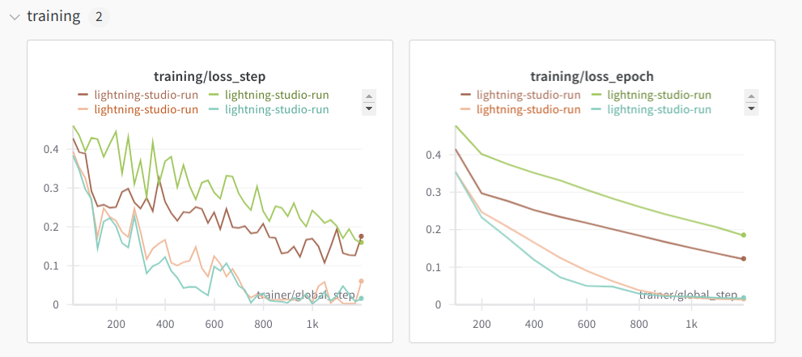
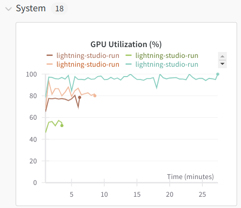
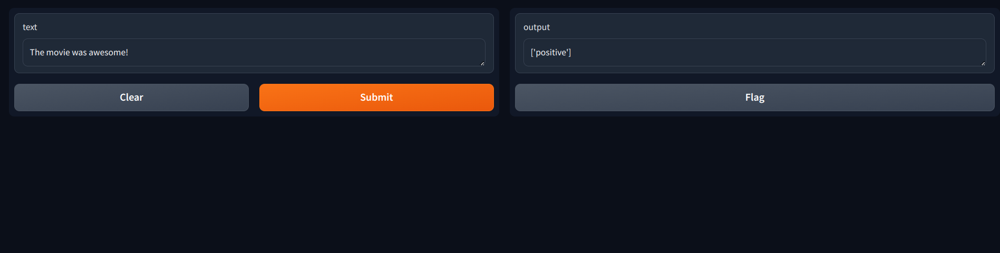
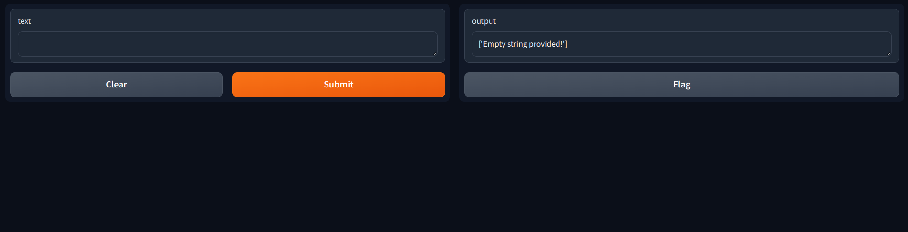

# Finetuning BERT using LoRA.

Parameters from Lightning training when lora rank is 16 and I use lora weights on query, value and feedforward matrices of transformer blocks.

```bash
  | Name             | Type       | Params | Mode
--------------------------------------------------------
0 | sbert            | BertModel  | 23.2 M | eval
1 | lora_module_list | ModuleList | 516 K  | train
2 | mlp              | MLP        | 58.1 K | train
--------------------------------------------------------
574 K     Trainable params
22.7 M    Non-trainable params
23.3 M    Total params
```

The trainable parameters are about `2.46%` of total parameters. The model checkpoint is of size `3.4 Mb` (LoRA weights, MLP weights and optimiser state). The training is done in `bfloat16`. The equvalent `fp32` checkpoint is `6.7 Mb` large.

## Training the model:
* I finetuned the model on the IMDB sentiment analysis dataset - 25000 training examples and 25000 validation examples.
* Frist, cd in the root of the repo.
* Second, run `export PYTHONPATH=.`
* Third, run `wandb login` to login to the wandb with your api key.
* Fourth, run `export WANDB_START_METHOD="thread"` otherwise some weird threading exception occurs. For more info see this <a href="https://github.com/wandb/wandb/issues/3223#issuecomment-1032820724">issue</a>.
* Fifth, set tokenizers env variable to avoid warnings 

    ```bash
    export TOKENIZERS_PARALLELISM=true
    ```
* Training command:

    ```bash
    python src/run_experiment.py fit --config fit_config.yaml --trainer.accelerator=gpu --trainer.devices=1 --trainer.max_epochs=12 --trainer.check_val_every_n_epoch=2 --trainer.log_every_n_step=25 --data.num_workers=4 --my_model_checkpoint.every_n_epochs=2 --model.lora_alpha=2 --model.lora_rank=16 --model.lr=3e-4 --model.do_lora=true --trainer.precision=bf16-true
    ```

### Results:

* After checking various configurations for the *rank* `(8, 16, 32)` and *alpha* parameter of LoRA `(0.25, 1, 2, 8)`, I found that the algorithm is not very sensitive to the rank but is very sensitive to alpha. The configuration with `lora_alpha=2` and `lora_rank=16` seemed to work well - achieving `90.12%` accuracy.

* Each experiment was run for 12 epochs with `batch_size=250` on a L4 GPU from a Lightning Studio.

    * When training in `fp32` experiments with full LoRA (query, value and ffn weight adaptors) experiments took about 28 minutes with validation accuracy `89.74%`.
    * When training in `bf16` experiments with full LoRA (query, value and ffn weight adaptors) experiments took 8 minutes and 38 seconds with validation accuracy `90.12%`.
    * When training in `bf16` with LoRA only on query and value matrices, experiments took 6 minutes and 17 seconds with validation accuracy `88.93%`.
    * When training in `bf16` with no LoRA (only the MLP classifier) experiments took 3m and 34 seconds with validation accuracy `80.72%`.
* The best performing model used full LoRA training and was trained in `bf16` format. You can see the comparison of the training curves from `wandb` for no-LoRA (green), LoRA only on query and value matrices (brown) and full LoRA on query, value and ffn matrices (beige). The training curve for full LoRA trained in `fp32` is in cyan colour. The full LoRA achieves the least training loss in both `fp32` and `bf16` precision. The GPU utilisation was about `85%` for full LoRA in `bf16`, `95%` for full LoRA in `fp32`, but less on the others holding everything else fixed.

* The training curves from wandb are given below:

    

* The gpu utilisation curves are shown below:

    

## Local testing with Docker:
* I managed to deploy the model in `bfloat16`. The model checkpoint needs to be saved as `saved_models/latest-bf16.ckpt`.
* Build the image from the root of the dir:
    ```bash
    docker build -t flask-pytorch-model -f api_server/Dockerfile .
    ```
* Run the container, should start the server:
    ```bash
    docker run -p 5000:5000 --name flask-cont-1 flask-pytorch-model
    ```
* From another terminal, test the app:
    This should be positive sentiment

    ```bash
    curl -X POST http://0.0.0.0:5000/predict -H "Content-Type: application/json" -d '{"text": "The movie was wonderful!"}'
    ```

    This should be negative sentiment

    ```bash
    curl -X POST http://0.0.0.0:5000/predict -H "Content-Type: application/json" -d '{"text": "The movie was awful!"}'
    ```
* I got the following responses respectively:
    First result

    ```bash
    {"body":"{\"sentiment\": [\"positive\"]}","headers":{"Content-Type":"application/json"},"statusCode":200}
    ```

    Second result:
    
    ```bash
    {"body":"{\"sentiment\": [\"negative\"]}","headers":{"Content-Type":"application/json"},"statusCode":200}
    ```

### Gradio app:

* After `export PYTHOPATH=.` just run:

    ```bash
    gradio api_server/gradio_app.py
    ```

    You should get a public link - something that ends in `gradio.live` and open that link.

* I tested the app and got the following screenshops:

    

    and when I input an empty string:

    

* You can also serve from inside a Docker container. After you have built the image as described above, just run:

    ```bash
    docker run -p 5000:5000 --name flask-cont-1 flask-pytorch-model bash -c "python ./app/api_server/gradio_app.py"
    ```

    and navigate to `localhost:5000`.